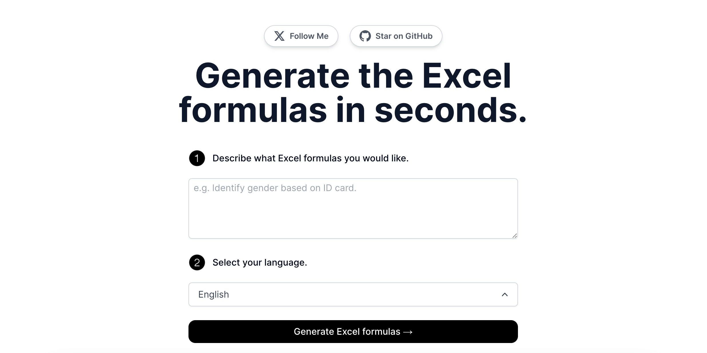

🌍 *[English](README.md) ∙ [简体中文](README-zh.md)*

# [AImage](https://www.aimage.top) — Free AI Image & Avatar Generator

Generate stunning AI avatars and images for free. Upload any photo and instantly transform it into cartoon, anime, or artistic styles. Perfect for all social platforms.

[](https://www.aimage.top)

## Features

- **Photo to Cartoon** — Transform any photo into cartoon style in seconds
- **AI Avatar Generator** — Create unique avatars for social media profiles
- **Anime Style** — Convert portraits into anime-style illustrations
- **Artistic Styles** — Apply various AI art styles to your images
- **Free to Use** — No sign-up required for basic usage
- **Multi-platform** — Optimized output for all social platforms

## How It Works

1. Upload your photo
2. Choose an AI style (cartoon, anime, artistic, etc.)
3. Download your generated image instantly

The project uses AI image generation APIs with streaming support via the [Vercel AI SDK](https://sdk.vercel.ai/docs). Image uploads are handled server-side and processed through AI models to generate stylized outputs.

## Stack

AImage is built on the following stack:

- **[Next.js 13](https://nextjs.org/)** — Frontend & Backend (App Router)
- **[TailwindCSS](https://tailwindcss.com/)** — Styles
- **[Prisma](https://www.prisma.io/) + PostgreSQL** — Database & storage
- **[NextAuth.js](https://next-auth.js.org/)** — Authentication
- **[Stripe](https://stripe.com/) + [Lemon Squeezy](https://www.lemonsqueezy.com/)** — Payments
- **[Upstash Redis](https://upstash.com/)** — Rate limiting & caching
- **[Contentlayer](https://contentlayer.dev/)** — MDX content management
- **[Vercel Analytics](https://vercel.com/analytics)** — Analytics
- **[Vercel](https://vercel.com/)** — Hosting

## Running Locally

1. Clone the repository and copy the environment file:

```bash
cp .env.example .env
```

2. Fill in the required environment variables in `.env`:

```env
# Database
DATABASE_URL=

# NextAuth
NEXTAUTH_SECRET=
NEXTAUTH_URL=http://localhost:3000

# GitHub OAuth (for login)
GITHUB_ID=
GITHUB_SECRET=

# Upstash Redis
UPSTASH_REDIS_REST_URL=
UPSTASH_REDIS_REST_TOKEN=

# Stripe (optional)
STRIPE_SECRET_KEY=
STRIPE_WEBHOOK_SECRET=
```

3. Install dependencies and start the dev server:

```bash
pnpm install
pnpm dev
```

The app will be available at `http://localhost:3000`.

## One-Click Deploy

Deploy to [Vercel](https://vercel.com) with one click:

[](https://vercel.com/new/clone?repository-url=https://github.com/servanter/ai-magic&project-name=aimage&repository-name=ai-magic&demo-title=AImage&demo-description=Free%20AI%20Image%20%26%20Avatar%20Generator&demo-url=https://www.aimage.top&demo-image=https://www.aimage.top/og.png)

## License

MIT
